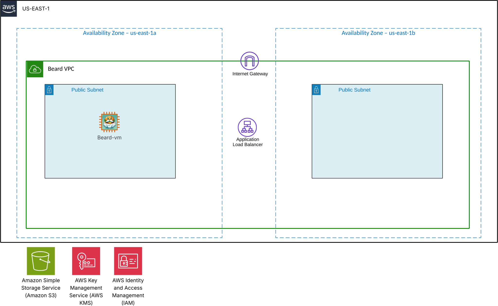

# beardctl

**beardctl** is a Go-based CLI tool that simplifies the setup and deployment of the *Beard* web app into AWS. It automates key infrastructure tasks using Terraform and Ansible and provides basic self-healing capabilities via a monitoring agent.

> **Note:** This tool is currently in **pre-release** and has only been tested in the **AWS commercial us-east-1** region using Administrator IAM Role. Deployments in other regions may fail.

---

## 🚀 Getting Started

### 1. Download the Binary

### 🔽 Download

| Platform | Arch | Binary |
|----------|------|--------|
| macOS    | arm64 | [beardctl-v0.1.0-darwin-arm64.zip](https://github.com/AndyMills-CloudBeard/beardctl/releases/download/v0.1.0/beardctl-v0.1.0-darwin-arm64.zip) |
| macOS    | amd64 | [beardctl-v0.1.0-darwin-amd64.zip](https://github.com/AndyMills-CloudBeard/beardctl/releases/download/v0.1.0/beardctl-v0.1.0-darwin-amd64.zip) |
| Linux    | amd64 | [beardctl-v0.1.0-linux-amd64.zip](https://github.com/AndyMills-CloudBeard/beardctl/releases/download/v0.1.0/beardctl-v0.1.0-linux-amd64.zip) |

Run the following to download and install the `beardctl` binary (MacOS ARM64 if other os update url from above ^):

```sh
curl -L -o beardctl.zip https://github.com/AndyMills-CloudBeard/beardctl/releases/download/v0.1.0/beardctl-v0.1.0-darwin-arm64.zip && unzip beardctl.zip && chmod +x beardctl-darwin-arm64 && sudo mv beardctl-darwin-arm64 /usr/local/bin/beardctl && beardctl --help

```

Setup working repo

```sh
git clone https://github.com/AndyMills-CloudBeard/beardctl.git && cd beardctl

```

### 2. Check Your Environment

Use `beardctl` to verify if your environment is ready:

```sh
beardctl env check
```

This checks for:

- Ansible
- Terraform
- AWS CLI
- AWS credentials (make sure your default region is us-east-1 and using Administrator Role)

> ⚠️ If you're using tools like `tfenv` or other custom wrappers, running `beardctl env setup` may cause issues.

To install all required dependencies on macOS:

```sh
beardctl env setup
```

### 3. Generate the SSH Keypair

Create a compatible SSH key and upload it to AWS:

```sh
beardctl env setup-keypair
```

This generates `~/.ssh/beardctl-key` and adds it to EC2 key pairs.

---

## Architecture Diagram

<p align="center">
  
</p>

## 🏗️ Deploying the Beard Web App

Run the following from the root directory:

```sh
beardctl deploy terraform/
```

This will:

- Use Terraform to provision AWS infrastructure (via open-source Coalfire modules)
- Wait for EC2 instance availability
- Generate an Ansible inventory file
- Run two playbooks:
  - `nginx.yml` – Installs and configures NGINX to serve the web app on port 80
  - `monitor.yml` – Uploads and configures `beardctl-monitor` as a systemd service

### 🛠 Self-Healing Monitor

The `beardctl-monitor` binary (source in `scripts/monitor.go`) runs as a background service. It:

- Checks the ALB DNS every 5 seconds
- Expects the page to contain: `Welcome to the Beard`
- Reboots the EC2 instance if 3 consecutive failures occur
- Logs each failure and reboot
- Uploads logs to S3

---

## 🌐 View Your App

After successful deployment, `beardctl` will print the ALB DNS name. Visit:

```
http://<alb_dns_name>
```

You should see a glorious **bearded cheeseburger**!

---

## 🥪 Test the Monitoring Logic

SSH into the EC2 instance:

```sh
ssh -i ~/.ssh/beardctl-key ec2-user@<IPADDRESS>
```

Stop NGINX:

```sh
sudo systemctl stop nginx
```

After \~15 seconds, the server will automatically reboot. Reconnect and check the logs:

```sh
sudo cat /var/log/beardctl-monitor.log
```

---

## 🌐 App Teardown

To teardown the AWS infrastructure in your account run the following beardctl command.

```sh
beardctl destroy terraform
```

> **Note:** The S3 Bucket will have items in it. The Beardctl tool does not currently support directly deleting items. Instead run the aws cli command to delete the bucket and items.

```sh
for bucket in $(aws s3api list-buckets --query 'Buckets[].Name' --output text | tr '\t' '\n' | grep '^beardctl-s3-errorlog-bucket-'); do
  echo "Deleting bucket: $bucket"
  aws s3api list-object-versions --bucket "$bucket" --output json | jq -r '.Versions[]?, .DeleteMarkers[]? | [.Key, .VersionId] | @tsv' | while IFS=$'\t' read -r key version; do
    aws s3api delete-object --bucket "$bucket" --key "$key" --version-id "$version"
  done
  aws s3api delete-bucket --bucket "$bucket"
done

```

## 🧼 Uninstall beardctl

To uninstall `beardctl`, run the inverse of the install command used earlier. For example:

```sh
sudo rm /usr/local/bin/beardctl
```

## Clean up local SSH Key and AWS Keypair

```sh
sudo rm /Users/$(whoami)/.ssh/beardctl-key.pub && sudo rm /Users/$(whoami)/.ssh/beardctl-key

```

```sh
aws ec2 delete-key-pair --key-name beardctl-key
```

---

## 📌 Known Limitations

- Only works in AWS `us-east-1`
- Only tested with Administrator Role

---

## 🧠 Contributing

This is a pre-release project under active development. PRs and issues are welcome!

Some known constraints encountered during development:

- **Time-based constraints:** Given more time, `beardctl` could support a broader range of custom Terraform modules and even custom Terraform providers. This would offer tighter control over infrastructure and enable ongoing maintenance capabilities.
- **Monorepo decision:** Ideally, the repository would be split for better long-term maintainability, but this was not necessary for the scope of a tech challenge.
- **Forked Coalfire EC2 module:** The public IP was not an output in the original module. A forked version was used to add this capability.
- **Simplified VPC logic:** Adapting Coalfire’s public VPC module to use only one VPC and two subnets introduced unnecessary complexity for this challenge. Building minimal Terraform resources was more efficient.

---

## 🔐 Production Considerations

If taken further into production use, the following improvements would be prioritized:

- Add robust error handling in both the CLI and monitoring components
- Write unit tests and end-to-end integration tests
- Use custom Terraform providers for tighter control and built-in policy enforcement
- Integrate Open Policy Agent (OPA) for built-in policy-as-code enforcement during provisioning
- Support blue/green deployments with built-in environment awareness
- Reduce the learning curve around Terraform/Ansible by standardizing guardrails
- Enable `cobra` YAML-based overrides for custom use cases

---
